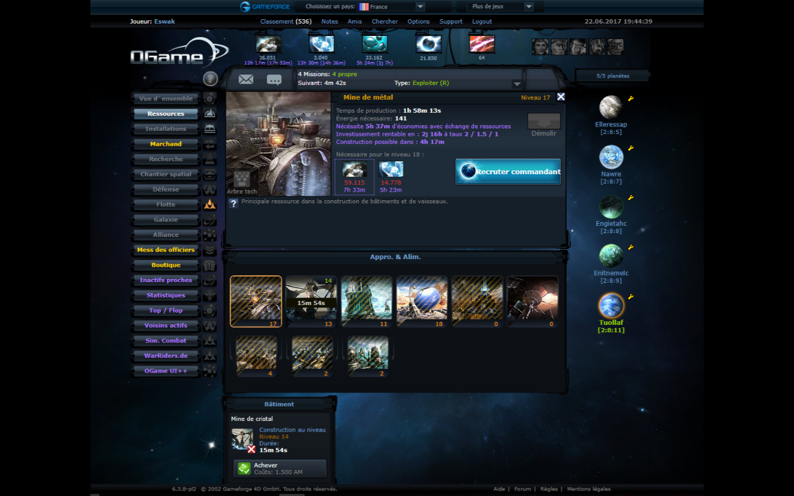
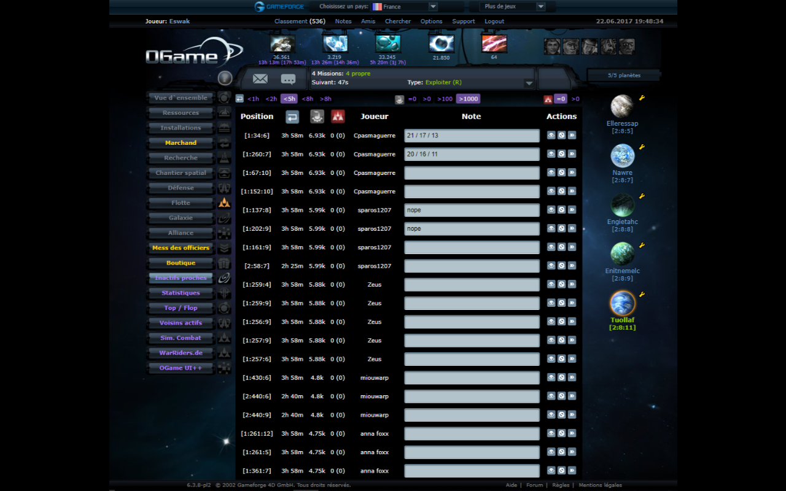
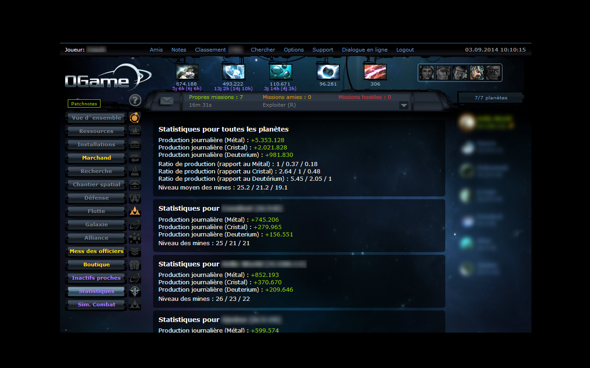

# [OGame UI++](https://chrome.google.com/webstore/detail/ogame-ui++/nhbgpipnadhelnecpcjcikbnedilhddf)

A Google Chrome extension (converted from user-script) that enhances the OGame interface by adding elements and menu entries.

Available in-game languages :
 - :gb: English
 - :fr: French
 - :es: Spanish
 - :tr: Turkish
 - :de: German

This extension improves the user interface by adding several features :
 - New tab : nearby idles (+ notes)
 - New tab : active neighbours (+ notes)
 - New tab : account's global stats
 - Add a link to speedsim's websim in the menu
 - Add a link to your war-riders.de profile in the menu
 - Displays the Return On Investment (ROI) time when viewing a mine or plasma technology
 - Displays in how much time your storage will be full (total & remaining time)
 - Displays total time required to gather resources for any construction
 - Circles the limiting reagent in each construction
 - Displays time before you can make a construction (Commander-like)
 - Displays the max. buildable units with your current resources (Commander-like)

