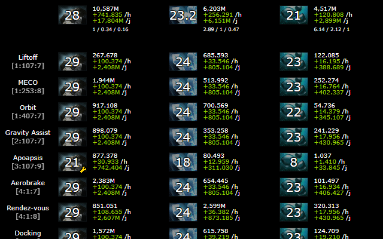
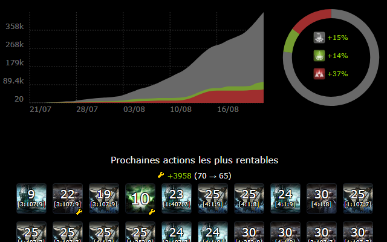
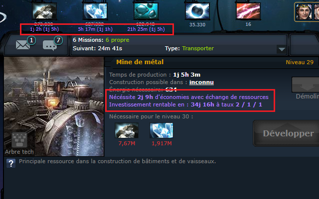
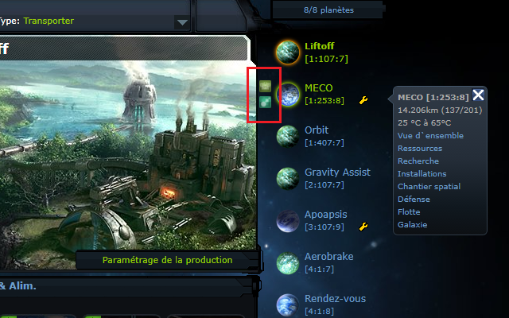
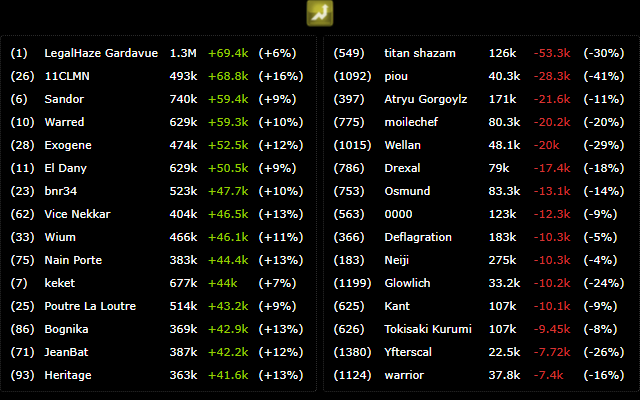
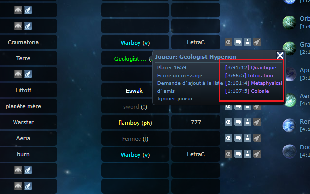

# [OGame UI++](https://chrome.google.com/webstore/detail/ogame-ui++/nhbgpipnadhelnecpcjcikbnedilhddf)

A Google Chrome extension that enhances the OGame interface by adding elements and menu entries.

Available in-game languages :
 - :gb: English
 - :fr: French
 - :es: Spanish
 - :tr: Turkish
 - :de: German
 - :poland: Polish

This extension improves the user interface by adding several features :
  - Remaining storage time under current planet's resources
  - Statistices tab : look at all your planet's resources ticking in real time
  - Next recommended builds : know the ROI on your mines & build wisely
  - Pre-fill the solar satelite text field if you have negative energy
  - See the daily server top/flop (biggest point increase/drop)
  - Fast deploy/transport icons when you hover your planets
  - Add custom links in your left menu

